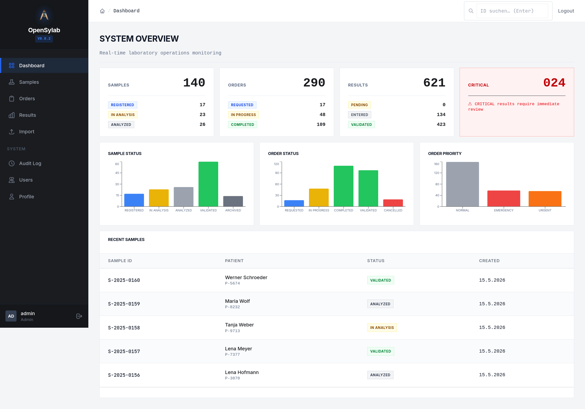
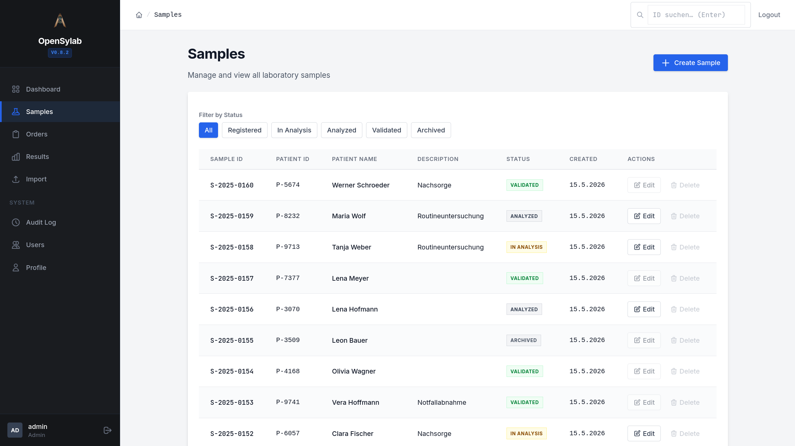
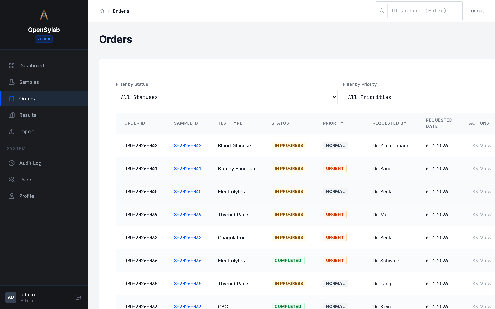
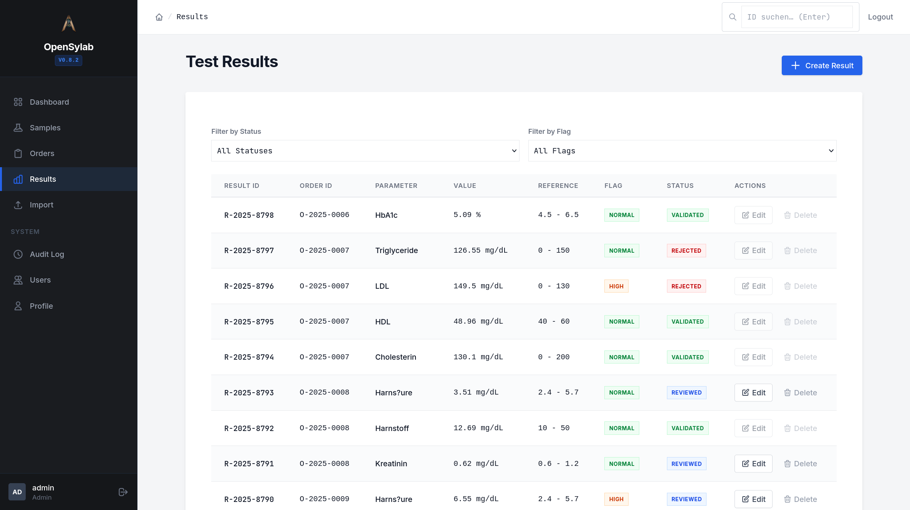
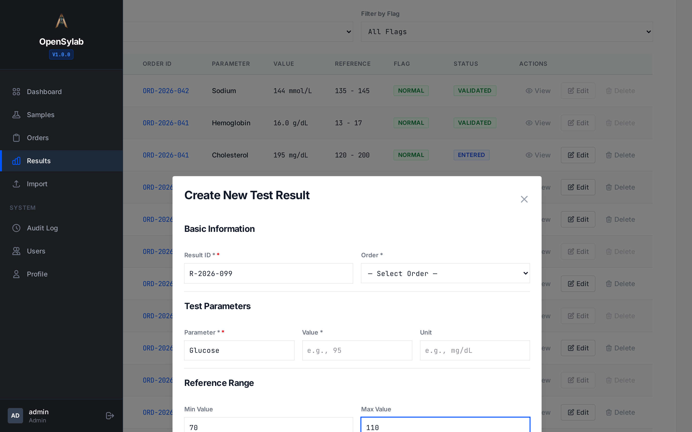
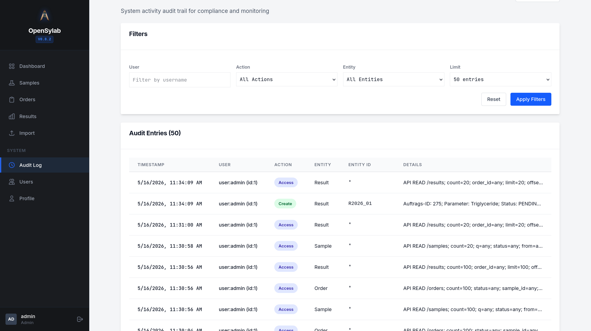
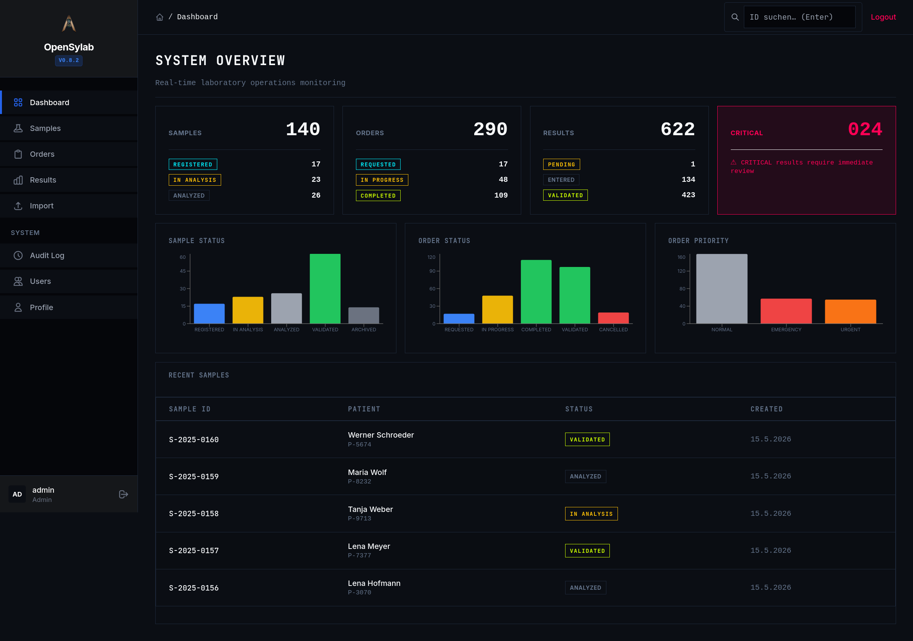

# OpenSylab LIMS

**Open-Source LIMS für die medizinische Diagnostik — ISO 15189-konform, selbst gehostet, MIT-lizenziert.**

[](CHANGELOG.md)
[](#lizenz)
[](#tests)
[](src/)
[](frontend/)
[](frontend/src/)
[](#sicherheit)

OpenSylab ist ein LIMS für kleine bis mittlere Diagnostiklabore, die ein vollständiges, ISO 15189-taugliches System betreiben wollen — ohne Enterprise-Lizenzkosten, ohne US-Cloud-Abhängigkeit, ohne Datenbankserver.

---

## Warum OpenSylab?

### ⚖️ ISO 15189 Audit-Trail als Architektur-Fundament

Jede CREATE / UPDATE / DELETE-Operation auf Proben, Aufträgen, Ergebnissen und Benutzern erzeugt zwingend einen `AuditEntry` mit `user_id`, `action`, `entity_type`, `entity_id` und `timestamp` — direkt in der Datenbankschicht, nicht als optionales Feature. Keine andere Open-Source-LIMS-Lösung implementiert das als unveräußerliches Fundament. Compliance ist hier kein Modul, das man zuschaltet.

### 🔌 HL7 v2.5.1 + FHIR R4 — nativ, kein Middleware-Server

Native C++-Parser für HL7 v2.5.1 (`ORU^R01`) und FHIR R4 Bundles (Patient, Specimen, ServiceRequest, Observation) — kein separater FHIR-Middleware-Server, kein Java-Heap, keine Dependency auf externe Dienste. Import und Export direkt über die REST-API.

### 🔓 MIT-Lizenz · Self-Hosted · Keine Datenbankserver-Abhängigkeit

MIT-Lizenz bedeutet: kein Copyleft, keine Lizenz-Compliance-Bürokratie für IT-Abteilungen, keine Einschränkungen für kommerzielle Weiterentwicklung. SQLite als embedded Datenbank: Backup = Datei kopieren, Betrieb auf einer günstigen ARM-VM möglich, kein DBA-Personal erforderlich. Patientendaten verlassen die eigene Infrastruktur nicht.

### 🚀 Minimaler Ressourcenverbrauch durch nativen C++17-Core

Kein JVM-Warmup, kein Interpreter-Overhead, kein Framework-Bloat. OpenSylab läuft auf Hardware, auf der kein Java-basiertes LIMS auch nur startet — relevant für Edge-Deployments direkt am Analysegerät oder ressourcenbeschränkte On-Premise-Umgebungen.

### 🛡️ Sicherheit mit konkreten Mechanismen

PBKDF2-HMAC-SHA256 (210.000 Iterationen, Random-Salt), HMAC-SHA256 JWT, TOTP/MFA (RFC 6238), RBAC auf vier Rollen (ADMIN / OPERATOR / VIEWER / CUSTOM) mit Auth-Check vor JSON-Parse, Rate-Limiting auf dem Login-Endpoint, TLS-Enforcement via `--force-https`.

### ⚡ Neo-Clinical Industrial UI

Designphilosophie: "User Competence statt User Delight." Monospace-Datenfont für tabellarische Ziffern, hoher Kontrast, Information Density die Labortechniker bevorzugen. Kein generisches SaaS-Styling.

---

## Screenshots

### Dashboard
<!-- SCREENSHOT: Hauptansicht nach Login -->
<!-- Aufnahme: http://192.168.10.140:5173/ (als admin eingeloggt) -->
<!-- Zeigt: KPI-Kacheln (Proben, Aufträge, Ergebnisse, Kritisch), Aktivitäts-Charts, letzte Proben-Tabelle -->

*Echtzeit-Übersicht: Proben, Aufträge, kritische Ergebnisse und Aktivitätsdiagramm*

### Proben-Verwaltung
<!-- SCREENSHOT: Seite /samples mit mindestens 5 Einträgen verschiedener Status -->
<!-- Aufnahme: Filter auf "Alle Status", Suche leer, erste Seite -->
<!-- Zeigt: Tabelle mit sample_id, patient_id, Status-Badge, Aktions-Buttons -->

*Probenliste mit Status-Filter, Barcode-Scan und Soft-Delete (Status → ARCHIVED)*

### Auftrags-Verwaltung
<!-- SCREENSHOT: Seite /orders mit Aufträgen verschiedener Prioritäten -->
<!-- Aufnahme: Enthält mindestens je einen NORMAL, URGENT, EMERGENCY-Auftrag -->
<!-- Zeigt: Prioritäts-Badge-Farben (grau/orange/rot), Status-Workflow-Spalte -->

*Aufträge nach Priorität (NORMAL / URGENT / EMERGENCY) und Status-Workflow*

### Ergebnisse & Auto-Flag
<!-- SCREENSHOT: Seite /results mit Ergebnissen verschiedener Flags -->
<!-- Aufnahme: Enthält NORMAL (grün), LOW (blau), HIGH (orange), CRITICAL (rot) Flags -->
<!-- Zeigt: Flag-Farb-Badges, Referenzbereich-Spalte, numerischer Messwert -->

*Testergebnisse mit automatischer Flaggung: NORMAL / LOW / HIGH / CRITICAL*

### Ergebnis erfassen — Referenzbereich & Auto-Flag
<!-- SCREENSHOT: Modal "Neues Ergebnis" geöffnet, Wert außerhalb Referenzbereich eingegeben -->
<!-- Aufnahme: Wert = 15.2, Ref Min = 4.0, Ref Max = 11.0 → Flag zeigt automatisch "HIGH" -->
<!-- Zeigt: Formular mit Auto-Flag-Berechnung in Echtzeit -->

*Ergebniseingabe mit automatischer Flag-Berechnung bei Abweichung vom Referenzbereich*

### Audit-Log
<!-- SCREENSHOT: Seite /audit-log mit mehreren Einträgen, Filter-Panel oben -->
<!-- Aufnahme: Mindestens CREATE, UPDATE, DELETE Aktionen sichtbar; Export-Button sichtbar -->
<!-- Zeigt: Tabelle mit Timestamp, Benutzer, Aktion, Entity-Typ, Details -->

*Vollständiger ISO-15189-konformer Audit-Trail mit Filterung und CSV-Export*


### Dark Mode 
<!-- SCREENSHOT: Dashboard im Dark Mode (sudo-Tastenkombination aktiviert) -->
<!-- Aufnahme: s-u-d-o eingeben außerhalb Inputs → Terminal-Industrial-Theme -->
<!-- Zeigt: Acid-Green (#CCFF00), Cyan (#00F0FF) Akzente auf dunklem Hintergrund -->

*Terminal Industrial Dark Mode mit Neon-Akzenten — aktiviert via `sudo`-Tastenkombination*

---

## Für wen ist OpenSylab?

| Zielgruppe | Warum OpenSylab passt |
|---|---|
| **Kleine bis mittlere Diagnostiklabore** | ISO 15189-Audit-Trail + RBAC ohne Enterprise-Lizenzkosten (LabWare, STARLIMS: ab 100.000 USD/Jahr) |
| **Forschungslabore in Universitätskliniken** | Vollständiger Workflow (Sample → Order → Result → Audit) mit klinischem Compliance-Niveau |
| **Labore mit Datenschutz-Anforderungen (DSGVO)** | Self-Hosted, keine US-Cloud-Abhängigkeit, Patientendaten in eigener Infrastruktur |
| **IT-Teams ohne DBA-Personal** | SQLite embedded: kein Datenbankserver, kein Connection-Pool, Backup via Dateikopie |
| **Einrichtungen mit KIS-Integration** | HL7 v2.5.1 + FHIR R4 nativ — kein separater Middleware-Server erforderlich |

OpenSylab ist **nicht** geeignet für: Hochdurchsatz-Labore mit >100 gleichzeitigen Schreibzugriffen (Single-Writer-Limit von SQLite), Labore die SaaS-Betrieb ohne eigene IT-Infrastruktur benötigen.

---

## Features — v0.8.2

### Labordaten-Verwaltung
| Feature | Beschreibung |
|---------|-------------|
| **Probenverwaltung** | CRUD, Barcode-Scan (BarcodeDetector API), Status-Workflow: REGISTERED → IN_ANALYSIS → ANALYZED → VALIDATED → ARCHIVED |
| **Auftragsverwaltung** | Verknüpfung mit Proben, Prioritäten (NORMAL / URGENT / EMERGENCY), Status-Workflow, Transition-Validierung im Backend |
| **Ergebniseingabe** | Auto-Flag bei Eingabe: NORMAL / LOW / HIGH / **CRITICAL** (margin-basiert: 50 % des Referenzintervalls) — manuelle Überschreibung möglich |
| **Soft-Delete** | Proben → ARCHIVED, Aufträge → CANCELLED, Ergebnisse → REJECTED — Zeilen bleiben für Audit-Trail erhalten |
| **Referenzbereiche** | Pro Ergebnis `reference_low` / `reference_high`, Flag wird bei jedem Update neu berechnet |
| **Paginierung** | Server-seitige Paginierung auf allen Listen-Endpoints (limit / offset) |
| **Globale Suche** | Header-Suchleiste navigiert per `?q=` zu Samples oder Orders |

### Datenimport / -export
| Feature | Beschreibung |
|---------|-------------|
| **Batch-CSV-Import (Proben)** | RFC 4180, BOM-tolerant, 5-MB-Limit, Fehler-Tracking pro Zeile |
| **Batch-CSV-Import (Ergebnisse)** | Multiline-Felder mit korrektem Escape-State-Machine |
| **HL7 v2.5.1** | ORU^R01 Import + Export via HTTP-API (`/api/v1/hl7/import`) mit vollständigem Feld-Escaping |
| **FHIR R4** | Bundle-Import (Patient, Specimen, ServiceRequest, Observation) + Export via HTTP-API |
| **Audit-Log-Export** | CSV-Export (ADMIN only) mit konfigurierbarer Retention-Policy |
| **Statistiken** | Dashboard-Kacheln, Statusverteilung, kritische Ergebnisse (Echtzeit, Backend-aggregiert) |

### Sicherheit
| Feature | Beschreibung |
|---------|-------------|
| **JWT-Authentifizierung** | HMAC-SHA256, Ablaufzeit konfigurierbar via `OPENSYLAB_JWT_SECRET` |
| **PBKDF2-Passwort-Hashing** | 210.000 Iterationen, Random-Salt, Salt-Leer-Guard, konstanter Zeitvergleich (OWASP 2023) |
| **RBAC** | 4 Rollen: ADMIN / OPERATOR / VIEWER / CUSTOM — auf allen Schreib-Endpoints erzwungen, Auth-Check vor JSON-Parse |
| **Rate-Limiting** | 10 Versuche / 60 s pro IP auf `/api/v1/auth/login`, query-string-resistent |
| **MFA (TOTP)** | RFC 6238 HMAC-SHA1, ±1 Zeitfenster (90 s), Google Authenticator kompatibel |
| **LDAP** | Optionale LDAP-Authentifizierung mit lokalem Shadow-Account und Rollen-Mapping |
| **Letzter-Admin-Schutz** | `updateUser`, `deleteUser`, `assignUserRole` blockieren Demotierung des letzten Admins — transaktional, kein TOCTOU |
| **Self-Delete-Guard** | Admin kann sich nicht selbst deaktivieren |
| **Audit bei allen Writes** | Jedes CREATE / UPDATE / DELETE erzeugt AuditEntry mit `user_id`, `action`, `entity`, `timestamp` |
| **Fehler-Sanitisierung** | HTTP-Antworten enthalten keine SQLite-Internals |
| **TLS/HTTPS** | `--tls-cert` / `--tls-key` Flags; `--force-https` verhindert HTTP-Betrieb in Prod |

### Frontend / UX
| Feature | Beschreibung |
|---------|-------------|
| **React 18 + TypeScript strict** | Keine `any`-Typen im Produktionscode, 0 TypeScript-Fehler |
| **RBAC im UI** | `canWrite`-Guards auf allen Create/Edit/Delete-Buttons; Sidebar-Links rollenabhängig |
| **Dark Mode** | Terminal-Industrial-Ästhetik via `sudo`-Tastenkombination (Easter Egg) |
| **Responsive Tabellen** | Sekundäre Spalten auf Tablet ausgeblendet (`md:hidden`) |
| **useEntityList-Hook** | Universeller paginierter Listen-Hook mit Abbruch-Mechanik, Race-Condition-sicher |
| **MFA-Login-Flow** | Zweistufiger Login: Credentials → TOTP-Code |
| **Sichere Logout-Navigation** | Sidebar-Logout navigiert sofort zu `/login` |
| **Health-Endpoint** | `GET /api/v1/health` — unauthentifiziert, liefert `{"status":"ok","version":"0.8.2"}` |
| **Version-SSOT** | `CMakeLists.txt` → `include/version.h` (C++); `package.json` → `VITE_APP_VERSION` (Frontend) |

### Qualität
| Metrik | Wert |
|--------|------|
| **Unit-Tests** | 181 passing |
| **TypeScript** | strict mode, 0 Errors |
| **npm audit** | 0 Vulnerabilities |
| **Bug-Hunts** | 12 Iterationen (diese Session), 3 aufeinanderfolgende saubere Runs — 21 Dateien, 30+ Bugs behoben. v0.8.2: 4 regressions fixed |
| **Gesamt Bug-Hunts** | 68 Iterationen total, 90+ Bugs behoben |

---

## Technologie-Stack

### Backend
- **Sprache**: C++17
- **Datenbank**: SQLite3 (embedded, kein externer Server nötig)
- **Auth**: PBKDF2-HMAC-SHA256 (Passwörter) · HMAC-SHA256 JWT · HMAC-SHA1 TOTP
- **Kryptographie**: OpenSSL
- **Build**: CMake 3.15+

### Frontend
- **Framework**: React 18 + TypeScript (strict mode)
- **Build**: Vite 7
- **Routing**: React Router v6
- **HTTP**: Axios mit JWT-Interceptor + Token-Expiry-Guard
- **Styling**: Tailwind CSS 3
- **Charts**: Recharts

---

## Schnellstart

### Voraussetzungen
- CMake ≥ 3.15
- GCC / Clang mit C++17-Support
- OpenSSL
- Node.js ≥ 18
- SQLite3 (Entwicklungsbibliotheken)

### Build & Start

```bash
# 1. Repository klonen
git clone https://github.com/AurevionSec/openSylab.git
cd openSylab

# 2. Backend bauen
cmake -B build -DCMAKE_BUILD_TYPE=Release
cmake --build build --parallel $(nproc)

# 3. Server starten (Port 9080, DB wird automatisch angelegt)
./build/bin/OpenSylab --api --api-port 9080 --db opensylab.db

# 4. Frontend bauen & starten
cd frontend
npm install
echo "VITE_API_URL=http://localhost:9080/api/v1" > .env.production
npm run build
npx serve dist --listen 5173 --single
```

Browser öffnen: **http://localhost:5173**  
Standard-Login: `admin` / `admin` → **sofort Passwort ändern!**

### Docker

```bash
docker compose up -d
```

Detaillierte Anleitung: [docs/DOCKER.md](docs/DOCKER.md)

---

## Konfiguration

| Umgebungsvariable | Standard | Beschreibung |
|-------------------|---------|-------------|
| `OPENSYLAB_JWT_SECRET` | dev-secret | JWT-Signaturschlüssel **(in Prod: zufällig generieren!)** |
| `OPENSYLAB_CORS_ORIGIN` | `http://localhost:5173` | Erlaubte Frontend-Origin |
| `OPENSYLAB_DB_PATH` | `opensylab.db` | Datenbankpfad |
| `OPENSYLAB_TLS_CERT` | — | Pfad zum TLS-Zertifikat (PEM) |
| `OPENSYLAB_TLS_KEY` | — | Pfad zum TLS-Schlüssel (PEM) |

```bash
# Produktionsstart mit TLS
OPENSYLAB_JWT_SECRET="$(openssl rand -hex 32)" \
OPENSYLAB_CORS_ORIGIN="https://lims.meinlabor.de" \
./build/bin/OpenSylab \
  --api --api-port 9443 \
  --tls-cert /etc/ssl/lims.crt \
  --tls-key  /etc/ssl/lims.key \
  --force-https \
  --db /var/lib/opensylab/lims.db
```

---

## Architektur

```
┌─────────────────────────────────────────────────┐
│  Frontend (React 18 / TypeScript)               │
│  http://localhost:5173                          │
└──────────────────┬──────────────────────────────┘
                   │ HTTPS / JWT
┌──────────────────▼──────────────────────────────┐
│  REST API  (C++17)                              │
│  Port 9080/9443  ·  /api/v1/*                  │
│                                                 │
│  Layer 4: ApiServer   (HTTP-Routing, TLS, CORS) │
│  Layer 3: JwtAuth     (Token-Validierung, RBAC) │
│  Layer 2: Utils       (CSV, HL7, FHIR, CLI)     │
│  Layer 1: Database    (SQLite3-Persistenz)      │
│  Layer 0: Core        (Domain-Entities)         │
└──────────────────┬──────────────────────────────┘
                   │
┌──────────────────▼──────────────────────────────┐
│  SQLite3  (embedded)  ·  opensylab.db           │
└─────────────────────────────────────────────────┘
```

**Schichtenregel:** Layer N darf nur Layer N-1 importieren — keine Circular Dependencies.

---

## API-Übersicht

| Methode | Endpunkt | Beschreibung | Auth |
|---------|----------|-------------|------|
| `GET` | `/api/v1/health` | Health-Check + Version | — |
| `POST` | `/api/v1/auth/login` | JWT-Login (+ MFA) — rate-limited | — |
| `GET` | `/api/v1/samples` | Probenliste (`?q=`, `?status=`) | JWT |
| `POST` | `/api/v1/samples` | Probe anlegen | OPERATOR+ |
| `PUT` | `/api/v1/samples/:id` | Probe aktualisieren (Transition validiert) | OPERATOR+ |
| `GET` | `/api/v1/orders` | Auftragsliste | JWT |
| `POST` | `/api/v1/orders` | Auftrag anlegen | OPERATOR+ |
| `GET` | `/api/v1/results` | Ergebnisliste (`?flag=`, `?status=`) | JWT |
| `POST` | `/api/v1/results` | Ergebnis eingeben | OPERATOR+ |
| `GET` | `/api/v1/audit` | Audit-Log (gefiltert, exportierbar) | ADMIN |
| `GET` | `/api/v1/users` | Benutzerliste | ADMIN |
| `POST` | `/api/v1/hl7/import` | HL7 v2.5.1 ORU^R01 Import | OPERATOR+ |
| `POST` | `/api/v1/fhir/import` | FHIR R4 Bundle Import | OPERATOR+ |
| `GET` | `/api/v1/stats` | Dashboard-Statistiken (Backend-aggregiert) | JWT |

Vollständige API-Dokumentation: [docs/API.md](docs/API.md)

---

## Tests

```bash
# Backend-Tests ausführen
cmake --build build && ./build/bin/opensylab_tests

# Frontend-Typprüfung
cd frontend && npx tsc --noEmit

# CI-äquivalent (mit Timeout)
timeout 60 ./build/bin/opensylab_tests
```

**181 Unit-Tests passing** — Backend (C++): Datenbank, Domain-Entities, API-Router, CSV-Import, HL7, FHIR, Statistiken, Utils.

Weitere Details: [docs/TESTING.md](docs/TESTING.md)

---

## Versionierung

Die Versionsnummer hat **eine** kanonische Quelle pro Layer:
- **C++**: `CMakeLists.txt` → `project(VERSION x.y.z)` → generiert `include/version.h` im Build-Tree
- **Frontend**: `frontend/package.json` → `"version"` → `import.meta.env.VITE_APP_VERSION`

Siehe [docs/VERSIONING.md](docs/VERSIONING.md) für den Release-Prozess.

---

## Mitwirken

1. Fork & Branch: `git checkout -b feat/mein-feature`
2. Implementieren + Tests schreiben
3. `cmake --build build && timeout 60 ./build/bin/opensylab_tests` — alle Tests grün
4. `cd frontend && npx tsc --noEmit` — 0 TypeScript-Fehler
5. Pull Request öffnen

---

## Lizenz

MIT — siehe [LICENSE](LICENSE)

---

## Changelog

Vollständige Versionshistorie: [CHANGELOG.md](CHANGELOG.md)

**Aktuelle Version: [0.8.2](CHANGELOG.md#082---2026-05-14)** — Test-Regression-Fix: alle 181 Tests grün (isValidStatusString-Refactor).
